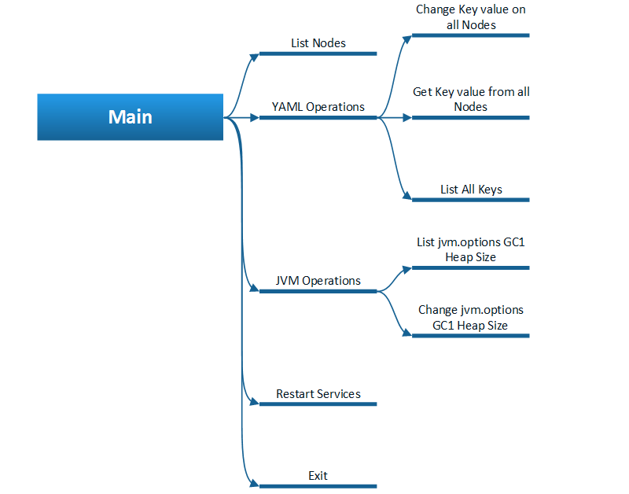
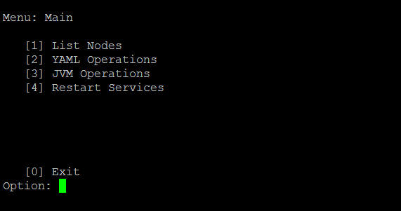
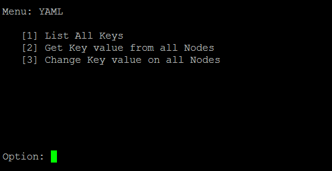

# Simple Menu

Python class for draw simples menus with sub-level.

## Getting Started

These instructions will get you a copy of the project up and running on your local machine for development and testing purposes. See deployment for notes on how to deploy the project on a live system.

### Prerequisites

Developed and tested in Linux Ubuntu and Python 2.7


### Installing

A step by step series of examples that tell you have to get a development env running

1. Create a folder called "smenu" inside the folder of your project.
2. Copy the smenu.py and `__init__.py` files to the smenu folder
3. Do class import for your project normally.

* If the import is successful, a file called smenu.pyc must be created, this file (compiled python file) must be maintained.

## Functions

### keypress

show_menu(Menu):
Description: Draw menus and capture keypress (0-9, Esc) to navigate between Main Menu and sub-levels
Esc: Move back to previous menu or exit from Main Menu

The parameter Menu is a List od Dict with pre-defined structure as below:



```
Dict{'<Name of Menu>': List[Dict{'Item': '<0-9>', 'Title': '<Title of Menu>', 'Action': '<Return string, function, etc / Name of sub Menu between {}>'},
              Dict{'Item': '<0-9>', 'Title': '<Title of Menu>', 'Action': '<Return string, function, etc / Name of sub Menu between {}>'},
              ...
              ],
     '<Name of SubMenu>': List[Dict{'Item': '<0-9>', 'Title': '<Title of Menu>', 'Action': '<Return string, function, etc / Name of sub Menu between {}>'},
              Dict{'Item': '<0-9>', 'Title': '<Title of Menu>', 'Action': '<Return string, function, etc / Name of sub Menu between {}>'},
              ...
              ],
     ...
     }
     

lst_Menus = {'Main': [{'Item': '1', 'Title': 'List Nodes', 'Action': 'function1("List Nodes")'}, 
                      {'Item': '2', 'Title': 'YAML Operations', 'Action': '{YAML}'}, 
                      {'Item': '3', 'Title': 'JVM Operations', 'Action': '{JVM}'}, 
                      {'Item': '4', 'Title': 'Restart Services', 'Action': 'function1("Restart Services")'}, 
                      {'Item': '0', 'Title': 'Exit',   'Action': 'menu_exit()'}], 
             'YAML': [{'Item': '1', 'Title': 'List All Keys', 'Action': 'function1("List All Keys")'},
                      {'Item': '2', 'Title': 'Get Key value from all Nodes', 'Action': 'function1("Get Key value from all Nodes")'},
                      {'Item': '3', 'Title': 'Change Key value on all Nodes', 'Action': 'function1("Change Key value on all Nodes")'}], 
             'JVM': [{'Item': '1', 'Title': 'List jvm.options GC1 Heap Size', 'Action': 'function1("List jvm.options GC1 Heap Size")'},
                     {'Item': '2', 'Title': 'Change jvm.options GC1 Heap Size', 'Action': 'function1("Change jvm.options GC1 Heap Size")'}]}

```                   
                     
Return: None for Esc (Exit) or name of function to call (Action)


## Deployment

Additional notes about how to deploy this on a live system:
Para deploy em ambiente de live:
1) Create a folder called "smenu" inside the folder of your project.
2) Copy the smenu.pyc and `__init__.pyc` files to the smenu folder

Note: Unless you really have experience, do not install directly on /usr/local/lib/python2.7/dist-packages

For next versions will be available installation by setup or pip.

## Examples of use

```
import smenu

lst_Menus = {'Main': [{'Item': '1', 'Title': 'List Nodes', 'Action': 'function1("List Nodes")'}, 
                      {'Item': '2', 'Title': 'YAML Operations', 'Action': '{YAML}'}, 
                      {'Item': '3', 'Title': 'JVM Operations', 'Action': '{JVM}'}, 
                      {'Item': '4', 'Title': 'Restart Services', 'Action': 'function1("Restart Services")'}, 
                      {'Item': '0', 'Title': 'Exit',   'Action': 'menu_exit()'}], 
             'YAML': [{'Item': '1', 'Title': 'List All Keys', 'Action': 'function1("List All Keys")'},
                      {'Item': '2', 'Title': 'Get Key value from all Nodes', 'Action': 'function1("Get Key value from all Nodes")'},
                      {'Item': '3', 'Title': 'Change Key value on all Nodes', 'Action': 'function1("Change Key value on all Nodes")'}], 
             'JVM': [{'Item': '1', 'Title': 'List jvm.options GC1 Heap Size', 'Action': 'function1("List jvm.options GC1 Heap Size")'},
                     {'Item': '2', 'Title': 'Change jvm.options GC1 Heap Size', 'Action': 'function1("Change jvm.options GC1 Heap Size")'}]}

obj_SMenu = smenu.smenu(lst_Menus)

def function1(sParameter):
    print('\033[16;05H' + sParameter)


def MainMenu():
    print "\033c"        
    str_retorno = obj_SMenu.show_menu('Main')  
    str_retorno = ''
    while str_retorno not in ('menu_exit', None):
        str_retorno = obj_SMenu.show_menu('Main') 
        if str_retorno not in ('menu_exit', None):
            exec(str_retorno)

MainMenu()

    
```




## Versioning
```
=======================================================================================
== Log Changes:
== Date:            2018-04-12
== Author:          Fausto Branco
== Version:         1.0.0
== Description:     Initial Version
=======================================================================================

```
## Authors
```
=======================================================================================
== Script Info:		smenu.py - Class with functions draw simples menus with sub-level 
==
=======================================================================================
== Create Author:	Fausto Branco
== Create Date:		2018-04-12
== Actual Version:  1.0.0
== Description:		
=======================================================================================
== Log Changes:
== Date:            2018-04-12
== Author:          Fausto Branco
== Version:         1.0.0
== Description:     Initial Version
=======================================================================================

```
## License


